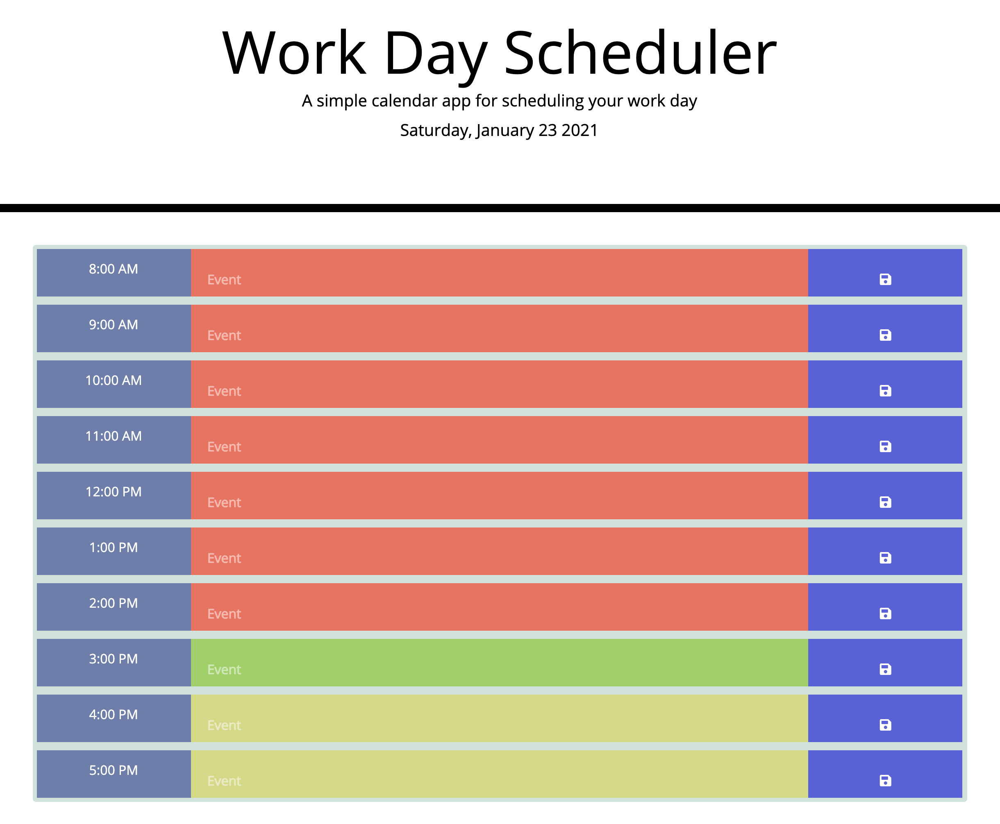

# day-planner
This day planner allows the user to save daily events for a regular 8am to 5pm work schedule. The calendar changes color throughout the day to reflect past, current and future hours. The user is able to save events to local storage, allowing them to refresh the page and change broswer tab without losing track of their daily tasks. The calender also reflects the current date at the top of the page. 

## Technology

The website was built using HTML, CSS and Javascript, Bootsrap and JQuery as well as FontAwesome icons.

## Pages

Single responsive page containing the day planner.

## Contributing

Pull requests are welcome, but should be limited to improving the layout and styles. No special software is required to clone and run the website other than a basic code editor and a browser of choice. 

## License

MIT
